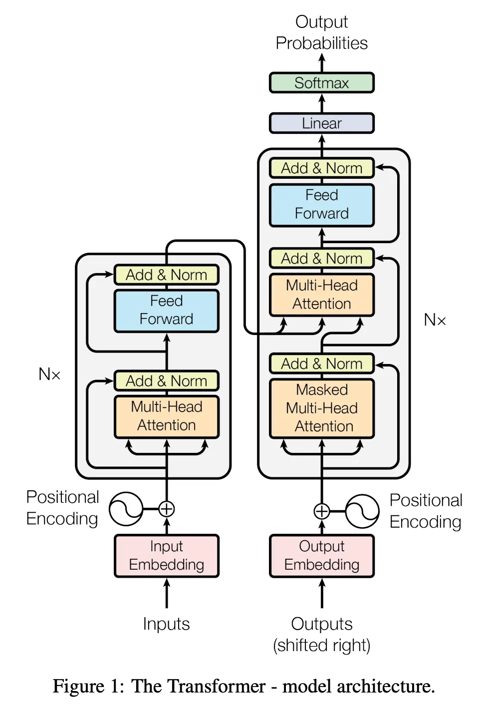
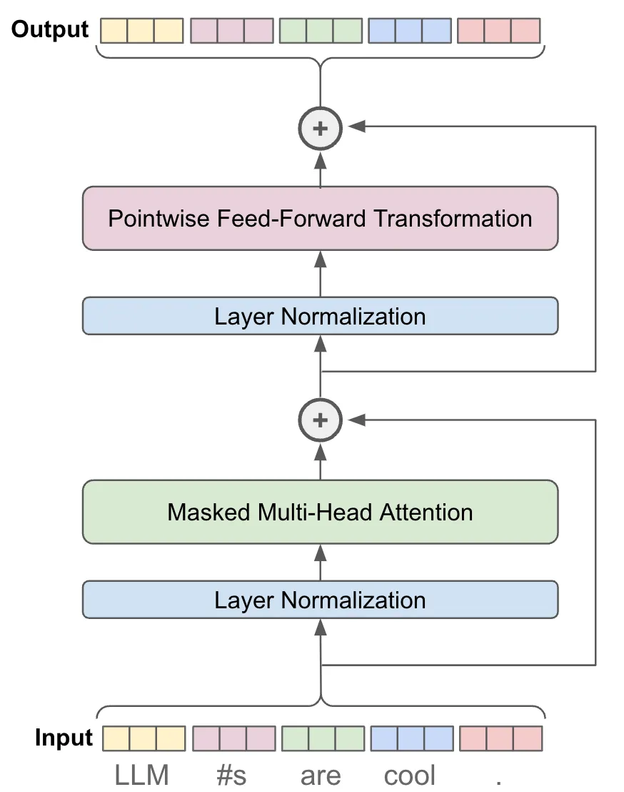
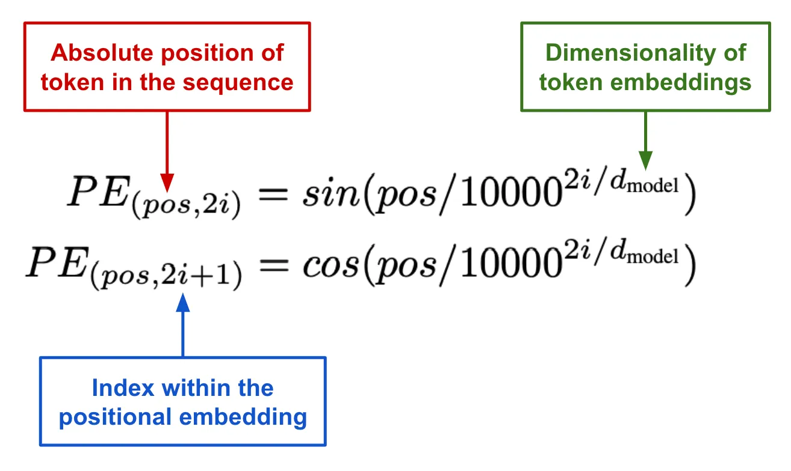
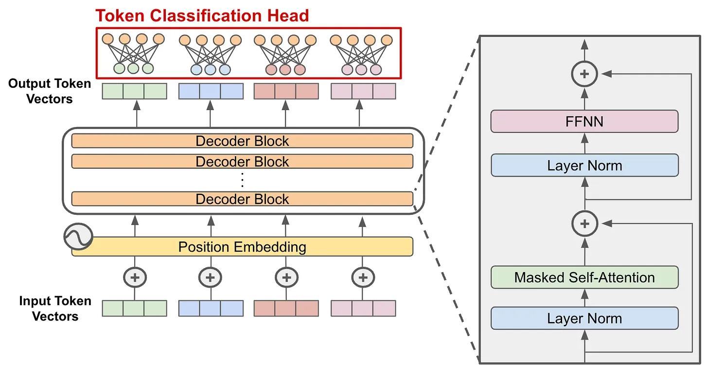
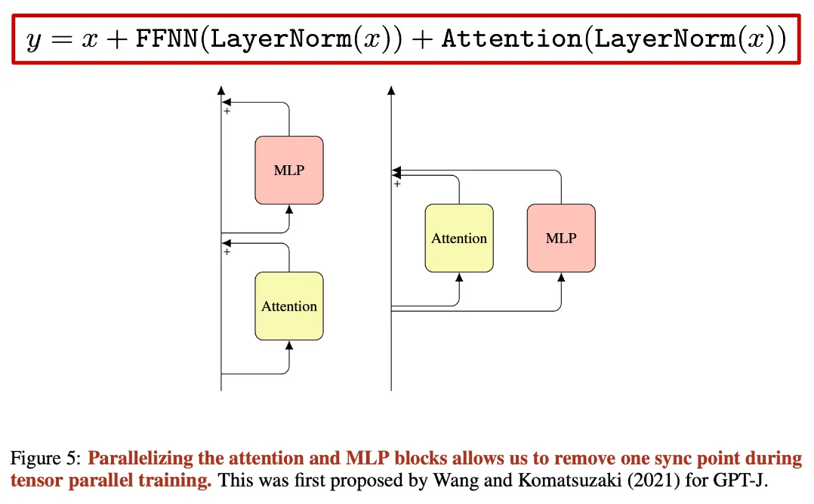
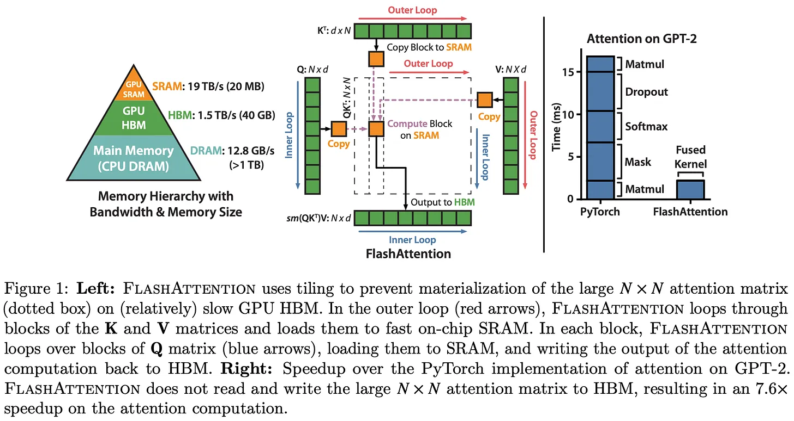
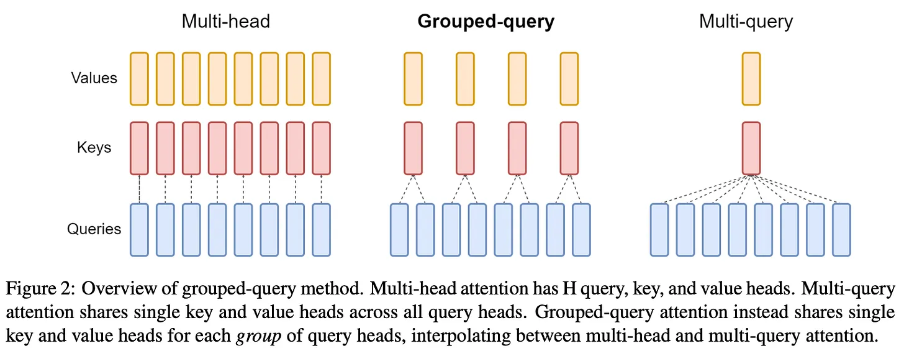
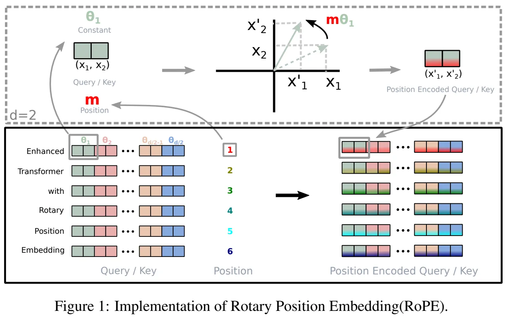
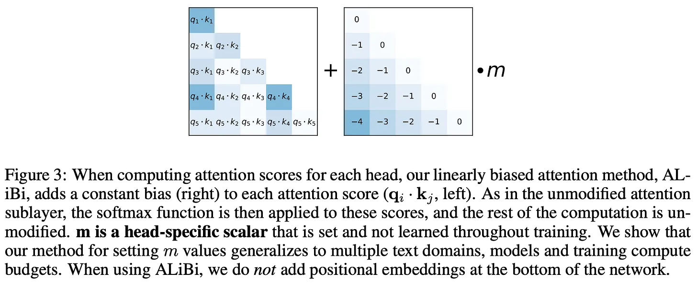

## Decoder-Only Transformers: The Workhorse of Generative LLMs

## Decoder-Only Transformers: The Workhorse of Generative LLMs

# Decoder-Only Transformer 详细解读


[https://cameronrwolfe.substack.com/p/decoder-only-transformers-the-workhorse](https://cameronrwolfe.substack.com/p/decoder-only-transformers-the-workhorse)





# Decoder-Only Transformer


## 1. 总体框架


这篇文章要解释的是：为什么现代大语言模型大多仍然建立在 decoder-only transformer 之上，以及这个架构内部到底由哪些部件组成。


最核心的主线可以概括为：


text -> tokenizer -> token ids -> token embeddings + position information -> transformer blocks -> logits over vocabulary -> next-token prediction


也就是说，文本先被切成 token，再被映射成向量；这些向量经过多层 transformer block；最后每个位置输出一个对整个词表的概率分布，用来预测下一个 token。


每层 decoder 包含：


一个掩码多头自注意力 + feed‑forward 网络 + 残差连接 + 层归一化


### 基本记号


$$
B = batch size \\
T = sequence length \\
d = model dimension \\
H = number of heads \\
d_h = d / H \\
V = vocabulary size
$$


输入张量记作 X，形状是 [B, T, d]。


## 2. Self-Attention 的核心思想


self-attention 的本质不是“比较 token 相似度”，而是：


对序列中的每个位置，决定它应该从哪些位置取信息，以及分别取多少。


self-attention 的第一步，是对输入序列里的每个 token 向量，各做三次不同的线性变换。


这三次变换分别生成：

- query 向量序列
- key 向量序列
- value 向量序列

所以，原来只有一份输入 token 序列，经过三套不同参数的映射后，变成了三份新序列


为此，输入 X 会先被投影成三组向量：(输入乘上参数矩阵，本质就是算参数矩阵)


$$
Q = XW_Q\
K = XW_K\
V = XW_V
$$


这里可以这样理解：


Q 表示“我在寻找什么信息”
K 表示“我这里有什么信息可供匹配”
V 表示“如果你关注我，你最终真正读取什么内容”


所以 attention 的流程其实就是：


“用 query 和每个 key 比一比，看它和谁更匹配；匹配越高，对应的 value 权重越大；最后把所有 value 按权重加权求和，得到输出。”


训练会自动推动参数朝着“更能降低任务损失”的方向更新。


于是模型最终学会了一种内部表示方式，使得：

- query 和 key 的点积能有效反映相关性
- value 能携带对当前任务有帮助的信息

## 3. 注意力分数


每个位置 i 会用自己的 query 去和所有位置的 key 做点积，从而得到匹配分数。


矩阵形式写成：SCORE


$S(q,k) = QK^T$


为了让训练更稳定，实际使用的是缩放点积注意力：


$S(q.k) = \frac{QK^T}{\sqrt{d_h}}$


然后对每一行做 softmax：


$A = \mathrm{softmax}(S(q.k))$


这里 A 的每一行都表示：


当前位置在更新自己时，对所有位置分别分配了多少注意力权重。


### 为什么输出是 AV


注意力的输出不是直接对输入 X 做加权，而是对 V 做加权汇总：


$Y=AV$


这很关键，因为 attention 的逻辑是：


先用 Q 和 K 算出“该看谁”
再用这些权重去加权 V
最后得到新的表示 Y


## 4. Causal Self-Attention


decoder-only transformer 不能看未来 token，因为它的训练目标是根据前文预测后文。


所以在 softmax 之前，需要对注意力分数矩阵加 mask：


对角线以上的所有元素都设为 $-\infty$


然后再做：


$A = \mathrm{softmax}(S_{\mathrm{mask}})$


这样一来，第 i 个 token 只能看见 1 到 i 的位置，不能看见未来位置。


这就是 causal mask，也是 autoregressive language modeling 成立的结构条件。


## 5. Multi-Head Attention


单头 attention 往往不够，因为模型可能需要同时捕捉多种不同关系。


所以实际做法是使用多头注意力。第 h 个头写成：


$\mathrm{head}_h = \mathrm{softmax}\left(\frac{Q_h K_h^T}{\sqrt{d_h}}\right)V_h$


所有头计算完成后，再拼接起来：


$\mathrm{MHA}(X) = \mathrm{Concat}(\mathrm{head}_1, \ldots, \mathrm{head}_H)W_O$


它的直觉是：


不同的 head 可以在不同的子空间中学习不同类型的依赖关系。


## 6. LayerNorm


transformer 中还需要归一化来稳定训练。最经典的是 LayerNorm：


$\mathrm{LN}(x) = \gamma \frac{x - \mu}{\sqrt{\sigma^2 + \epsilon}} + \beta$


这里的均值和方差是在最后一个维度上计算的，也就是 embedding 维度（特征维度）。


它的作用不是增加表达能力，而是让深层网络更容易训练。


### **层归一化（Layer Normalization）与批归一化（Batch Normalization）的对比**


| 特性                   | **层归一化**                         | **批归一化**                            |
| -------------------- | -------------------------------- | ----------------------------------- |
| **计算方式**             | 在每个样本的特征维度上计算均值和标准差              | 在每个 mini-batch 上计算均值和标准差            |
| **使用场景**             | 适用于自然语言处理（NLP）、变长序列数据处理          | 适用于计算机视觉（CV）、固定输入的批量数据处理            |
| **对 mini-batch 的依赖** | 不依赖 mini-batch，适合小批量或单样本推理       | 依赖 mini-batch，适合大批量数据               |
| **主要优点**             | 适合小批量数据和序列数据；推理时不受 mini-batch 影响 | 适用于大批量数据，能够有效稳定训练过程                 |
| **主要缺点**             | 对每个样本独立规范化，可能导致训练不稳定（特别是在很深的网络中） | 需要较大 mini-batch，推理时可能无法使用（推理时小批量数据） |


### **使用细节**

- **层归一化（LayerNorm）**：
    - **计算方式**：在每个样本的特征维度（如输入的嵌入向量维度）上计算均值和标准差，并进行标准化。
    - **应用场景**：常用于**自然语言处理（NLP）和变长序列数据**。由于推理时常常是单个样本，层归一化在这种情况下表现良好。
    - **优点**：没有对 mini-batch 的依赖，适合小批量数据或单个样本进行推理。
    - **使用注意**：适合需要处理变长序列或批量数据较小的任务，比如 Transformer 中的自注意力机制。
- **批归一化（BatchNorm）**：
    - **计算方式**：在每个 mini-batch 的所有样本中，计算每个特征维度的均值和标准差，并对每个样本进行标准化。
    - **应用场景**：常用于**计算机视觉（CV）**中的大规模图像数据，尤其是在卷积神经网络（CNN）中。批归一化在训练时可以通过更大 mini-batch 的统计信息获得更稳定的均值和标准差。
    - **优点**：能加速训练，减少梯度消失问题，并且通过稳定化每层的输入使得训练过程更加平滑。
    - **使用注意**：批归一化在推理阶段受限于 mini-batch 的大小，通常不能直接在单个样本上使用。

### **总结**

- **层归一化** 更适合 **自然语言处理（NLP）** 等任务，尤其是当批量数据较小时，推理时也不会受到影响。
- **批归一化** 更适合 **计算机视觉（CV）**，它能够通过整个 mini-batch 的统计信息来稳定训练，特别是对大批量数据进行训练时，效果非常好。

## 7. Feed-Forward Network


attention 不是 block 的全部。每个 transformer block 里还有一个前馈网络 FFN。


标准写法是：


$\mathrm{FFN}(x) = W_2 \sigma(W_1x + b_1) + b_2$


其中最常见的维度变化是：


$W_1 : d \to 4d$


$W_2 : 4d \to d$


这里的含义是：


attention 负责跨位置的信息交互
FFN 负责对每个位置的表示做更复杂的非线性变换


在现代的大型语言模型（LLM）中，如 **GPT**、**GPT-2**、**LLaMA-2** 等，每个 **Decoder-Only Transformer Block** 都包含一个 **逐点（pointwise）前馈神经网络**。这个前馈网络作用于每个输入的 **token 向量**，通过一个小型的前馈神经网络进行处理。


### **1. 前馈神经网络结构**


每个 **Decoder-Only Transformer Block** 中的前馈神经网络通常由两个 **线性层**（**linear layers**）组成，它们之间通过一个 **非线性激活函数** 连接。这个前馈网络的作用是将每个 **token 向量** 映射到一个新的表示，通常会有以下几个特点：

- **两层线性变换**：第一个线性层会将输入的 token 向量通过权重矩阵映射到一个 **更高维度** 的表示空间，第二个线性层将其映射回原来的维度。
- **非线性激活函数**：两层线性变换之间，会使用一个 **非线性激活函数**（例如 **ReLU**、**SwiGLU** 或 **GeLU**）来增加网络的表达能力。
- **隐藏维度更大**：前馈神经网络中的隐藏维度通常比输入维度大，**GPT**、**GPT-2** 等模型的隐藏维度通常是输入维度的 **4 倍**。

这种设计使得模型可以通过前馈网络来捕捉输入 token 向量之间的复杂非线性关系，从而增强模型的能力。


### **2. SwiGLU 激活函数**


在 **LLM（大型语言模型）** 中，选择合适的激活函数对于模型的性能至关重要。**SwiGLU**（Switched Gated Linear Unit）激活函数被广泛应用于许多现代的 LLM 中，如 **LLaMA-2** 和 **OLMo**，因为它在 **给定计算量的条件下** 提供了最好的性能。


**SwiGLU 的定义**


SwiGLU 激活函数是由两个线性变换和一个 **门控**（gating）机制组成的，其公式如下：


$\text{SwiGLU}(x) = \text{ReLU}(x) \cdot \text{Sigmoid}(x)$

- **ReLU(x)**：首先应用 **ReLU** 激活函数，这为输入提供了非线性变换。
- **Sigmoid(x)**：然后对输入应用 **Sigmoid** 函数，生成一个 **门控信号**，决定每个元素的激活程度。

SwiGLU 激活函数结合了 **ReLU** 和 **Sigmoid** 的优点，它通过 **Sigmoid 门控** 控制每个激活的强度，使得网络在 **计算效率** 和 **表达能力** 上达到更好的平衡。


**SwiGLU 激活的优势**

- **计算效率**：相比其他激活函数，SwiGLU 激活在给定计算资源的情况下能够提供更好的 **性能**。
- **非线性能力**：SwiGLU 能够为网络提供更强的 **非线性表示能力**，从而帮助模型学习更加复杂的模式。
- **广泛应用**：由于其在性能上的优势，SwiGLU 被 **LLaMA-2**、**OLMo** 等多个大规模语言模型所采用。

### **3. 与其他激活函数的比较**


尽管 **SwiGLU** 被证明在许多模型中表现良好，但并非所有的 LLM 都使用它。例如，**Falcon** 和 **Gemma** 等模型使用的是 **GeLU**（Gaussian Error Linear Unit）激活函数。

- **GeLU** 是一种平滑的非线性激活函数，它常常被用于 Transformer 模型中，因为它的表现与 **ReLU** 相似，但具有更好的平滑性。其公式为：

    $\text{GeLU}(x) = 0.5x \left( 1 + \text{tanh} \left( \sqrt{\frac{2}{\pi}}(x + 0.044715x^3) \right) \right)$

- **ReLU** 和 **GeLU** 都是常见的激活函数，它们相对简单且在许多任务中表现良好，但 **SwiGLU** 结合了 **ReLU** 和 **Sigmoid**，提供了更高的计算效率和性能。

## 8. Residual Connection


为了让深层网络能稳定训练，每个子层外面都加残差连接：


$y = x + f(x)$


它的含义是：


每一层不是推翻上一层，而是在上一层表示的基础上做增量修正。


## 9.一个标准 Transformer Block


把前面的部件组合起来，一个标准的 decoder-only transformer block 可以写成：


$x' = x + \mathrm{MHA}(\mathrm{LN}_1(x))$


$y = x' + \mathrm{FFN}(\mathrm{LN}_2(x'))$


这两条式子非常重要，因为它们几乎概括了整个 block 的核心：


先做跨位置的信息聚合
再做单位置的非线性变换





# Modern Decoder Only Transformer


图就在文章最开始，相信大伙已经非常熟悉了


## 1. 输入构造


输入文本首先被 tokenizer 切成 token，然后映射成 token embedding。


Tokenizer


tokenizer用Byte-Pair Encoding (BPE), SentencePiece, or WordPiece 之类的东西


[tokenization](https://huggingface.co/docs/transformers/en/tokenizer_summary) 有他的词典和编解码功能 [Building a GPT tokenizer(Youtube)](https://www.youtube.com/watch?v=zduSFxRajkE)


Token embeddings & Position embeddings


嵌入层→输入对应词典嵌入（d*Vocabulary）+三角函数位置嵌入(如下图)





<u>**不过这个没法生成比训练数据更长的文本，这种绝对位置编码是有局限性的**</u>


记第 t 个 token 的 embedding 为：


$e_t = E_{\mathrm{tok}}(x_t)$


位置 embedding 记为：


$p_t = E_{\mathrm{pos}}(t)$


那么输入层的表示就是：


$h_t^{(0)} = e_t + p_t$


这一步表示：


模型不仅要知道“这是什么 token”
还要知道“它在第几个位置”


## 2. 输出层


### 分类头（Classification Head）


在 **Decoder-Only Transformer** 模型的末尾，通常会添加一个 **分类头**。这个头的作用是将模型的输出转换为 **下一个 token 的概率分布**，从而完成任务如 **文本生成** 或 **下一个 token 预测**。


**分类头的工作原理：**

- **输出：** 在经过多层 **Transformer Block** 后，模型会输出一个大小相同的 **token 向量序列**，即每个输入的 token 会对应一个输出的向量。
- **转化为概率分布：** 为了进行 **文本生成** 或 **下一个 token 预测**，我们需要将每个 token 向量通过一个 **线性层**（classification head）转换为一个 **概率分布**。这个线性层的输入维度是 **d**（即 token 向量的维度），输出维度是 **V**，即 **词汇表的大小**。这个线性层的作用是将隐藏状态映射到词汇表空间，得到每个 token 是词汇表中各个词的概率。

具体来说，对于每个位置的 token 向量 ( $h_t$ )，我们通过一个线性变换：


$\mathrm{logits}_t = h_t W{\mathrm{vocab}} + b$

- 这里的 **logits** 是未归一化的输出，代表各个词汇的未归一化的概率。
- 然后，我们使用 S**oftmax** 函数将这些 logits 转换为概率分布。

$p(x_{t+1} \mid x_{\le t}) = \mathrm{Softmax}(\mathrm{logits}_t)$


这表示用当前位置的hidden state预测下一个位置(词概率)


**下一个 Token 预测：**

- 使用 **交叉熵损失**（cross-entropy loss），模型学习如何预测每个 token 后面的下一个 token。这是 **预训练** 阶段的目标，模型会通过这种方式学习每个 token 与下一个 token 之间的关系。

**推理（Inference）：**

- 在推理阶段，模型会 **自回归地**（autoregressively）生成文本。给定当前生成的序列，模型基于 **生成的 token 概率分布** 选择下一个最有可能的 token，继续生成下一个 token，直到生成完整的文本。

### **PyTorch 实现**


在提供的代码中，**GPT** 类实现了 **Decoder-Only Transformer** 的完整架构：





```python
class GPT(nn.Module):
    def __init__(self, d, H, T, V, layers, bias=False, dropout=0.2):
        super().__init__()
        self.transformer = nn.ModuleDict(dict(
            wte=nn.Embedding(V, d),  # token 嵌入
            wpe=nn.Embedding(T, d),  # 位置嵌入
            drop=nn.Dropout(dropout),
            blocks=nn.ModuleList([Block(d, H, T, bias, dropout) for _ in range(layers)]),  # 多层 Transformer block
            ln_f=nn.LayerNorm(d),  # 最后的层归一化
            head=nn.Linear(d, V, bias=bias),  # 分类头（linear层）
        ))

    def forward(self, idx, targets=None):
        device = idx.device
        _, T = idx.size()  # [B, T]
        pos = torch.arange(0, T, dtype=torch.long, device=device)

        # 生成 token 和位置嵌入
        tok_emb = self.transformer.wte(idx)  # [B, T, d]
        pos_emb = self.transformer.wpe(pos)  # [T, d]
        x = self.transformer.drop(tok_emb + pos_emb)

        # 通过所有的 decoder-only blocks
        for block in self.transformer.blocks:
            x = block(x)
        x = self.transformer.ln_f(x)  # 最后的层归一化

        if targets is not None:
            logits = self.transformer.head(x)  # 分类头
            loss = F.cross_entropy(
                logits.view(-1, logits.size(-1)),
                targets.view(-1),
                ignore_index=-1,
            )
        else:
            logits = self.transformer.head(x[:, [-1], :])  # 只看最后一个 token 进行推理
            loss = None

        return logits, loss
```


**代码解析：**

- **`wte`** **和** **`wpe`** 分别是 **token 嵌入** 和 **位置嵌入**。
- **`blocks`** 是多层 **Decoder-Only Transformer Block**，每个 block 由之前讨论的 **自注意力层** 和 **前馈神经网络** 构成。
- **`head`** 是 **分类头**，通过一个线性层将每个 token 向量转换为一个词汇表的概率分布。

**推理与损失计算：**

- **`targets`** 存在时，计算 **交叉熵损失**，用于模型的训练。
- **`targets`** 不存在时，进行 **推理**，模型生成 **下一个 token**。

### **总结**

- **分类头** 通过 **线性层** 将每个 token 向量转换为 **下一个 token 的概率分布**，从而进行 **文本生成** 或 **下一个 token 预测**。
- **GPT** 等 **Decoder-Only Transformer** 模型使用 **自回归生成** 的方式，在训练时通过交叉熵损失预测下一个 token，在推理时通过 **自回归采样** 生成下一个 token，直到生成完整的序列。
- 这种结构确保了模型能够在 **生成任务** 中有强大的表现，能够准确生成连续的文本。

## 现代变体


### **归一化操作的位置**


在标准的 **Transformer Block** 中，通常使用 **Layer Normalization** 进行归一化处理。具体来说，最常见的做法是：

- **在自注意力层（self-attention layer）和前馈神经网络层（feed-forward layer）之后进行归一化**。

然而，不同的实现可能对归一化的顺序有所不同。例如：

- **原始 Transformer 架构** 中的归一化操作是在 **自注意力层** 和 **前馈层** 之后进行的。这是一种标准的归一化操作顺序。

但在一些新的架构中，归一化可能出现在不同的位置：

- **Gemma** 架构使用了一种不同的做法，**对每个 Transformer 子层的输入和输出都进行归一化**，这与传统方法不同。具体来说，**Gemma** 会对 **输入和输出都进行归一化**，而标准做法通常只对其中一个进行归一化。
    > **“我们对每个 Transformer 子层的输入和输出进行归一化，这是一个偏离标准实践的方法，标准实践通常只对输入或输出之一进行归一化。”** 

这种做法可能帮助模型更好地稳定训练过程，因为归一化能有效地控制 **梯度流动**，减轻梯度消失或爆炸的问题。


### **并行 Transformer 块（Parallel Blocks）**


除了顺序地将输入通过自注意力层和前馈神经网络层处理，**一些模型架构** 如 **Falcon** 和 **PaLM** 采用了 **并行 Transformer 块结构**。


在这种并行结构中，**输入被同时送入自注意力层和前馈神经网络层**，而不是顺序处理。这种方式的优点是：

- **减少分布式训练中的通信开销**。在分布式训练环境下，模型的不同部分可能会在不同的计算节点上运行，因此并行处理可以减少不同计算节点之间的通信需求，提高训练效率。

虽然这种方法在 **性能上** 没有明显的降级，**Falcon** 和 **PaLM** 等模型发现这种并行处理结构对于训练速度和效率有积极作用，同时保持了模型的预测能力和性能。





### 归一化变体


RMSNorm


现代 LLM 常常把 LayerNorm 换成 RMSNorm。

- **RMSNorm**（Root Mean Square Layer Normalization）是层归一化的简化版本，旨在提高训练稳定性并改善模型的泛化能力。
- 它的公式与标准的 **Layer Normalization** 类似，但去除了均值的计算，改用 **均方根（Root Mean Square, RMS）** 来进行归一化。

它的写法是：


$\mathrm{RMSNorm}(x) = \gamma \frac{x}{\sqrt{\frac{1}{d}\sum_i x_i^2 + \epsilon}}$


其中：

- **x** 是输入张量。
- **n** 是输入的特征维度。
- **ϵ** 是为了避免除以零的微小常数。
- **γ** 是缩放参数

和 LayerNorm 相比，它更轻量，也常常更高效。


除了 **RMSNorm**，有些大型语言模型（LLM）还采用了修改过的层归一化形式，进一步提升 **硬件利用效率** 和 **训练速度**。


**(1) 低精度层归一化**

- 例如，**MPT** 模型（多任务预训练模型）采用了 **低精度层归一化**。这种做法通过降低计算精度来提升 **硬件利用效率**，尤其是在 **GPU 或 TPU** 上训练时，可以加快计算速度。
- 然而，低精度计算可能会导致在某些情况下 **损失函数波动（loss spikes）**，即模型的损失函数值可能会突然升高。

**(2) 排除偏置项（Bias Terms）**

- 许多现代 **LLM**（如 **OLMo**、**LLaMA-2** 和 **PaLM**）将 **层归一化** 中的 **偏置项（bias）** 排除在外。
- 在传统的 **层归一化** 中，每个归一化后的值会加上一个 **偏置项**。但在一些模型中， **去除偏置项** 不仅能 **减少计算量**，还可以 **提高训练速度**，且 **性能没有显著下降**。

    去除偏置项的好处包括：

    - **性能保持**：去除偏置项不会显著影响模型的性能，反而在某些情况下可能提高泛化能力。
    - **训练加速**：去除偏置项可以减少参数量，从而加速训练过程。

**(3) Transformer 层中完全去除偏置项**

- 一些模型（如 **LLaMA-2** 和 **PaLM**）不仅在 **层归一化** 中去除了偏置项，而且在 **整个 Transformer 模型** 的所有层中都 **去除了偏置项**。
- 这种做法帮助模型在训练时 **减少计算量**，并且不会对 **模型的最终表现** 产生负面影响，甚至可能带来一些 **性能提升** 和 **训练加速**。

### 自注意力变体


**1. 自注意力的效率问题**


在 Transformer 架构中，**自注意力** 是核心操作之一。然而，这个操作的计算复杂度是 **O(N^2)**，其中 **N** 是序列的长度。这意味着，当序列变得很长时，自注意力的计算成本会急剧增加。为了解决这个问题，提出了许多高效的 **自注意力变体**，如 **Reformer**、**SMYRF** 和 **Performer** 等，这些方法在理论上将自注意力的复杂度降低为 **O(N)**，但在实际应用中，往往无法实现预期的加速效果。


**2. FlashAttention**


为了进一步提高效率，**FlashAttention** 被提出，它通过一种 **硬件友好** 的方式重新定义了自注意力操作。FlashAttention 解决了自注意力操作中的 **内存瓶颈**，从而在 **训练和推理** 时都能提供显著的加速效果。





**FlashAttention 的优点：**

- **BERT-large 训练加速 15%**：在 **BERT-large** 的训练中，FlashAttention 提高了训练速度，减少了训练时间。
- **GPT-2 训练加速 3 倍**：对于 **GPT-2**，FlashAttention 提升了训练速度。
- **支持更长的上下文长度**：由于 **更好的内存效率**，FlashAttention 使得大型语言模型（LLMs）可以处理更长的输入序列。

在 **PyTorch 2.0** 发布后，**点积自注意力**（scaled dot-product attention）可以使用 **FlashAttention** 来替换，从而提高效率。许多 **LLM**（例如 **Falcon** 和 **MPT**）已经采用了 **FlashAttention**，而这一领域仍然有许多 **活跃的研究**，并出现了一些新技术：

- **FlashAttention-2**：这是 **FlashAttention** 的改进版本，进一步提升了效率。
- **FlashDecoding**：这是 **FlashAttention** 的一个扩展，旨在提高 **推理效率**，不仅仅是训练效率。

**3. Multi-query Attention 和 Grouped-query Attention**





**(1) Multi-query Attention**


在 **Multi-query Attention** 中，所有注意力头共享同一个 **key projection** 和 **value projection**。这种做法的优点是：

- **减少了计算开销**：不再为每个注意力头单独计算 **key** 和 **value** 的投影，而是所有头共享同一个投影矩阵。
- **推理速度提升**：虽然这种方法不会加速训练，但它显著提高了 **推理** 的速度。

例如，**Gemini**、**Falcon** 和 **PaLM** 等模型采用了 **multi-query attention**，通过这种方式优化了推理阶段的计算效率。


**(2) Grouped-query Attention (GQA)**


尽管 **Multi-query Attention** 提高了推理速度，但它可能会导致 **性能下降**。因此，一些模型（如 **LLaMA-2**）寻求 **Grouped-query Attention**（GQA）作为替代方法。**GQA** 的做法是：

- 将 **H 个注意力头** 分成 **多个组**，每个组内的头共享 **key** 和 **value** 投影，而不同组之间的投影是独立的。
- 这种方法在 **性能** 和 **效率** 上提供了平衡：**GQA** 保持了 **传统多头自注意力** 的性能，同时 **在效率上** 与 **multi-query attention** 相当。

GQA 是 **多头自注意力** 和 **多查询注意力** 之间的一种折衷，它通过共享投影在 **组内** 提高效率，同时避免了 **multi-query attention** 可能带来的性能损失。


### 更好的位置编码


我们前面提到了三角函数绝对位置编码的局限性，那么最后我们就来看看更好的位置编码


目标是两件事：


第一，让模型知道 token 的位置。


第二，让模型不仅记住“我是第 57 个 token”，还知道：

- 我和另一个 token 相隔多远
- 越远的 token，关系可能越弱
- 长序列时也能自然泛化

也就是说要做相对位置编码


所以后来提出了很多改进方法，这里重点讲两个最常见的：

- **RoPE**
- **ALiBi**

RoPE 是什么


**RoPE = 用旋转的方式，把位置信息直接写进 attention 的几何关系里。**





RoPE 全称是 **Rotary Positional Embedding**，中文通常叫**旋转位置编码**。


它的核心思想不是“直接把位置向量加到输入上”，而是：


**把位置信息编码进 attention 计算本身。**


更具体一点：

- 对 query 和 key 做一个跟位置有关的“旋转”
- 这样 attention 分数里就自然带上了位置信息

你可以先把它理解成：

> 每个位置的 token 向量会按不同角度旋转一下，再去做注意力计算。

这样做有几个好处：


**(1) 同时带有绝对位置和相对位置的信息**


它既知道“我在第几个位置”，也知道“我和你相距多远”。


**(2) 位置信息是在每一层 attention 里都注入的**


不是只在输入最开始加一次，而是每层都参与。


**(3) 更适合长上下文扩展**


比普通 absolute positional embedding 更容易推广到更长序列。


**(4) 距离越远，关联自然衰减**


也就是两个 token 离得很远时，它们彼此注意力会更弱，这很符合直觉。


ALiBi 是什么





ALiBi 全称是 **Attention with Linear Biases**。


它比 RoPE 还“朴素”。


它不搞额外位置向量，也不做旋转，而是直接在 attention 分数矩阵里加一个**偏置项 bias**。


原来的 attention 分数大概是：


$QK^T$


ALiBi 变成：


$QK^T + \text{bias}$


这个 bias 的特点是：

- 距离越远，惩罚越大
- 距离越近，惩罚越小

也就是它人为告诉模型：

> 两个 token 如果隔得远一点，那它们的 attention score 应该被压低一些。

所以 ALiBi 的核心思想就是：


**直接在线性地惩罚远距离注意力。**


ALiBi 为什么好：


**(1) 非常简单**


实现上只是在 attention matrix 上加一个固定 bias。


**(2) 不需要学习位置向量**


它的 bias 是静态的、非学习的。


**(3) 长序列外推能力很好**


文章里说它在“处理比训练更长的序列”这件事上，表现甚至比普通位置编码和 RoPE 还强。


**(4) 额外开销很小**


几乎不会明显增加计算和显存成本。


## **总结**


Decoder-only Transformer 仍然是现代生成式大语言模型的核心架构。虽然现在的 LLM 在规模、训练方法和细节设计上已经比早期 GPT 复杂得多，但底层主干仍然基本沿用了最初的 GPT 思路。


它的工作流程可以概括为五步：


第一，**构造输入**。模型先把文本通过 tokenizer 切成 token，再把每个 token 查表变成向量，也就是 token embedding。必要时，还会加入位置编码，让模型知道 token 的顺序。


第二，**因果自注意力**。这是 decoder-only Transformer 最核心的部分。每个 token 会根据前面 token 的信息更新自己的表示，但由于是 causal mask，它不能看到后面的 token，所以适合做“下一个 token 预测”。多头注意力则让模型能从不同角度同时建模上下文关系。


第三，**前馈网络**。在每个 block 里，每个 token 的向量还会单独经过一个小型神经网络，通常先升维到原来的约 4 倍，经过激活函数后再降回原维度，从而增强表达能力。


第四，**堆叠 Transformer blocks**。整个模型主体就是很多个 block 叠起来。虽然不同模型在归一化位置、并行结构等细节上会有变化，但核心子层始终是两部分：因果自注意力和前馈网络。同时通常还配有层归一化和残差连接，来保证训练稳定。


第五，**输出分类头**。模型最后会把每个位置的 hidden state 通过一个线性层映射到整个词汇表大小，得到对“下一个 token”的预测分布。训练时用它做 next token prediction，推理时则根据这个分布采样生成文本。


**decoder-only Transformer 的本质就是：把输入文本变成向量，通过多层“因果注意力 + 前馈变换”不断更新表示，最后用当前位置的 hidden state 去预测下一个 token。**


[https://www.notion.so/zfysjtu/Decoder-Only-Transformers-The-Workhorse-of-Generative-LLMs-33ec7a7eb81780bfbc9fe91e83e998df?v=8e0c7a7eb817830c93a588c8f3227f32&source=copy_link](/341c7a7eb8178059bf62feb67e137bb8)


[https://www.notion.so/zfysjtu/Decoder-Only-Transformers-The-Workhorse-of-Generative-LLMs-33ec7a7eb81780bfbc9fe91e83e998df?v=8e0c7a7eb817830c93a588c8f3227f32&source=copy_link](/341c7a7eb8178059bf62feb67e137bb8)


# Decoder-Only Transformer 详细解读


[https://cameronrwolfe.substack.com/p/decoder-only-transformers-the-workhorse](https://cameronrwolfe.substack.com/p/decoder-only-transformers-the-workhorse)


# Decoder-Only Transformer


## 1. 总体框架


这篇文章要解释的是：为什么现代大语言模型大多仍然建立在 decoder-only transformer 之上，以及这个架构内部到底由哪些部件组成。


最核心的主线可以概括为：


text -> tokenizer -> token ids -> token embeddings + position information -> transformer blocks -> logits over vocabulary -> next-token prediction


也就是说，文本先被切成 token，再被映射成向量；这些向量经过多层 transformer block；最后每个位置输出一个对整个词表的概率分布，用来预测下一个 token。


每层 decoder 包含：


一个掩码多头自注意力 + feed‑forward 网络 + 残差连接 + 层归一化


### 基本记号


$$
B = batch size \\
T = sequence length \\
d = model dimension \\
H = number of heads \\
d_h = d / H \\
V = vocabulary size
$$


输入张量记作 X，形状是 [B, T, d]。


## 2. Self-Attention 的核心思想


self-attention 的本质不是“比较 token 相似度”，而是：


对序列中的每个位置，决定它应该从哪些位置取信息，以及分别取多少。


self-attention 的第一步，是对输入序列里的每个 token 向量，各做三次不同的线性变换。


这三次变换分别生成：

- query 向量序列
- key 向量序列
- value 向量序列

所以，原来只有一份输入 token 序列，经过三套不同参数的映射后，变成了三份新序列


为此，输入 X 会先被投影成三组向量：(输入乘上参数矩阵，本质就是算参数矩阵)


$$
Q = XW_Q\
K = XW_K\
V = XW_V
$$


这里可以这样理解：


Q 表示“我在寻找什么信息”
K 表示“我这里有什么信息可供匹配”
V 表示“如果你关注我，你最终真正读取什么内容”


所以 attention 的流程其实就是：


“用 query 和每个 key 比一比，看它和谁更匹配；匹配越高，对应的 value 权重越大；最后把所有 value 按权重加权求和，得到输出。”


训练会自动推动参数朝着“更能降低任务损失”的方向更新。


于是模型最终学会了一种内部表示方式，使得：

- query 和 key 的点积能有效反映相关性
- value 能携带对当前任务有帮助的信息

## 3. 注意力分数


每个位置 i 会用自己的 query 去和所有位置的 key 做点积，从而得到匹配分数。


矩阵形式写成：SCORE


$S(q,k) = QK^T$


为了让训练更稳定，实际使用的是缩放点积注意力：


$S(q.k) = \frac{QK^T}{\sqrt{d_h}}$


然后对每一行做 softmax：


$A = \mathrm{softmax}(S(q.k))$


这里 A 的每一行都表示：


当前位置在更新自己时，对所有位置分别分配了多少注意力权重。


### 为什么输出是 AV


注意力的输出不是直接对输入 X 做加权，而是对 V 做加权汇总：


$Y=AV$


这很关键，因为 attention 的逻辑是：


先用 Q 和 K 算出“该看谁”
再用这些权重去加权 V
最后得到新的表示 Y


## 4. Causal Self-Attention


decoder-only transformer 不能看未来 token，因为它的训练目标是根据前文预测后文。


所以在 softmax 之前，需要对注意力分数矩阵加 mask：


对角线以上的所有元素都设为 $-\infty$


然后再做：


$A = \mathrm{softmax}(S_{\mathrm{mask}})$


这样一来，第 i 个 token 只能看见 1 到 i 的位置，不能看见未来位置。


这就是 causal mask，也是 autoregressive language modeling 成立的结构条件。


## 5. Multi-Head Attention


单头 attention 往往不够，因为模型可能需要同时捕捉多种不同关系。


所以实际做法是使用多头注意力。第 h 个头写成：


$\mathrm{head}_h = \mathrm{softmax}\left(\frac{Q_h K_h^T}{\sqrt{d_h}}\right)V_h$


所有头计算完成后，再拼接起来：


$\mathrm{MHA}(X) = \mathrm{Concat}(\mathrm{head}_1, \ldots, \mathrm{head}_H)W_O$


它的直觉是：


不同的 head 可以在不同的子空间中学习不同类型的依赖关系。


## 6. LayerNorm


transformer 中还需要归一化来稳定训练。最经典的是 LayerNorm：


$\mathrm{LN}(x) = \gamma \frac{x - \mu}{\sqrt{\sigma^2 + \epsilon}} + \beta$


这里的均值和方差是在最后一个维度上计算的，也就是 embedding 维度（特征维度）。


它的作用不是增加表达能力，而是让深层网络更容易训练。


### **层归一化（Layer Normalization）与批归一化（Batch Normalization）的对比**


| 特性                   | **层归一化**                         | **批归一化**                            |
| -------------------- | -------------------------------- | ----------------------------------- |
| **计算方式**             | 在每个样本的特征维度上计算均值和标准差              | 在每个 mini-batch 上计算均值和标准差            |
| **使用场景**             | 适用于自然语言处理（NLP）、变长序列数据处理          | 适用于计算机视觉（CV）、固定输入的批量数据处理            |
| **对 mini-batch 的依赖** | 不依赖 mini-batch，适合小批量或单样本推理       | 依赖 mini-batch，适合大批量数据               |
| **主要优点**             | 适合小批量数据和序列数据；推理时不受 mini-batch 影响 | 适用于大批量数据，能够有效稳定训练过程                 |
| **主要缺点**             | 对每个样本独立规范化，可能导致训练不稳定（特别是在很深的网络中） | 需要较大 mini-batch，推理时可能无法使用（推理时小批量数据） |


### **使用细节**

- **层归一化（LayerNorm）**：
    - **计算方式**：在每个样本的特征维度（如输入的嵌入向量维度）上计算均值和标准差，并进行标准化。
    - **应用场景**：常用于**自然语言处理（NLP）和变长序列数据**。由于推理时常常是单个样本，层归一化在这种情况下表现良好。
    - **优点**：没有对 mini-batch 的依赖，适合小批量数据或单个样本进行推理。
    - **使用注意**：适合需要处理变长序列或批量数据较小的任务，比如 Transformer 中的自注意力机制。
- **批归一化（BatchNorm）**：
    - **计算方式**：在每个 mini-batch 的所有样本中，计算每个特征维度的均值和标准差，并对每个样本进行标准化。
    - **应用场景**：常用于**计算机视觉（CV）**中的大规模图像数据，尤其是在卷积神经网络（CNN）中。批归一化在训练时可以通过更大 mini-batch 的统计信息获得更稳定的均值和标准差。
    - **优点**：能加速训练，减少梯度消失问题，并且通过稳定化每层的输入使得训练过程更加平滑。
    - **使用注意**：批归一化在推理阶段受限于 mini-batch 的大小，通常不能直接在单个样本上使用。

### **总结**

- **层归一化** 更适合 **自然语言处理（NLP）** 等任务，尤其是当批量数据较小时，推理时也不会受到影响。
- **批归一化** 更适合 **计算机视觉（CV）**，它能够通过整个 mini-batch 的统计信息来稳定训练，特别是对大批量数据进行训练时，效果非常好。

## 7. Feed-Forward Network


attention 不是 block 的全部。每个 transformer block 里还有一个前馈网络 FFN。


标准写法是：


$\mathrm{FFN}(x) = W_2 \sigma(W_1x + b_1) + b_2$


其中最常见的维度变化是：


$W_1 : d \to 4d$


$W_2 : 4d \to d$


这里的含义是：


attention 负责跨位置的信息交互
FFN 负责对每个位置的表示做更复杂的非线性变换


在现代的大型语言模型（LLM）中，如 **GPT**、**GPT-2**、**LLaMA-2** 等，每个 **Decoder-Only Transformer Block** 都包含一个 **逐点（pointwise）前馈神经网络**。这个前馈网络作用于每个输入的 **token 向量**，通过一个小型的前馈神经网络进行处理。


### **1. 前馈神经网络结构**


每个 **Decoder-Only Transformer Block** 中的前馈神经网络通常由两个 **线性层**（**linear layers**）组成，它们之间通过一个 **非线性激活函数** 连接。这个前馈网络的作用是将每个 **token 向量** 映射到一个新的表示，通常会有以下几个特点：

- **两层线性变换**：第一个线性层会将输入的 token 向量通过权重矩阵映射到一个 **更高维度** 的表示空间，第二个线性层将其映射回原来的维度。
- **非线性激活函数**：两层线性变换之间，会使用一个 **非线性激活函数**（例如 **ReLU**、**SwiGLU** 或 **GeLU**）来增加网络的表达能力。
- **隐藏维度更大**：前馈神经网络中的隐藏维度通常比输入维度大，**GPT**、**GPT-2** 等模型的隐藏维度通常是输入维度的 **4 倍**。

这种设计使得模型可以通过前馈网络来捕捉输入 token 向量之间的复杂非线性关系，从而增强模型的能力。


### **2. SwiGLU 激活函数**


在 **LLM（大型语言模型）** 中，选择合适的激活函数对于模型的性能至关重要。**SwiGLU**（Switched Gated Linear Unit）激活函数被广泛应用于许多现代的 LLM 中，如 **LLaMA-2** 和 **OLMo**，因为它在 **给定计算量的条件下** 提供了最好的性能。


**SwiGLU 的定义**


SwiGLU 激活函数是由两个线性变换和一个 **门控**（gating）机制组成的，其公式如下：


$\text{SwiGLU}(x) = \text{ReLU}(x) \cdot \text{Sigmoid}(x)$

- **ReLU(x)**：首先应用 **ReLU** 激活函数，这为输入提供了非线性变换。
- **Sigmoid(x)**：然后对输入应用 **Sigmoid** 函数，生成一个 **门控信号**，决定每个元素的激活程度。

SwiGLU 激活函数结合了 **ReLU** 和 **Sigmoid** 的优点，它通过 **Sigmoid 门控** 控制每个激活的强度，使得网络在 **计算效率** 和 **表达能力** 上达到更好的平衡。


**SwiGLU 激活的优势**

- **计算效率**：相比其他激活函数，SwiGLU 激活在给定计算资源的情况下能够提供更好的 **性能**。
- **非线性能力**：SwiGLU 能够为网络提供更强的 **非线性表示能力**，从而帮助模型学习更加复杂的模式。
- **广泛应用**：由于其在性能上的优势，SwiGLU 被 **LLaMA-2**、**OLMo** 等多个大规模语言模型所采用。

### **3. 与其他激活函数的比较**


尽管 **SwiGLU** 被证明在许多模型中表现良好，但并非所有的 LLM 都使用它。例如，**Falcon** 和 **Gemma** 等模型使用的是 **GeLU**（Gaussian Error Linear Unit）激活函数。

- **GeLU** 是一种平滑的非线性激活函数，它常常被用于 Transformer 模型中，因为它的表现与 **ReLU** 相似，但具有更好的平滑性。其公式为：

    $\text{GeLU}(x) = 0.5x \left( 1 + \text{tanh} \left( \sqrt{\frac{2}{\pi}}(x + 0.044715x^3) \right) \right)$

- **ReLU** 和 **GeLU** 都是常见的激活函数，它们相对简单且在许多任务中表现良好，但 **SwiGLU** 结合了 **ReLU** 和 **Sigmoid**，提供了更高的计算效率和性能。

## 8. Residual Connection


为了让深层网络能稳定训练，每个子层外面都加残差连接：


$y = x + f(x)$


它的含义是：


每一层不是推翻上一层，而是在上一层表示的基础上做增量修正。


## 9.一个标准 Transformer Block


把前面的部件组合起来，一个标准的 decoder-only transformer block 可以写成：


$x' = x + \mathrm{MHA}(\mathrm{LN}_1(x))$


$y = x' + \mathrm{FFN}(\mathrm{LN}_2(x'))$


这两条式子非常重要，因为它们几乎概括了整个 block 的核心：


先做跨位置的信息聚合
再做单位置的非线性变换


# Modern Decoder Only Transformer


图就在文章最开始，相信大伙已经非常熟悉了


## 1. 输入构造


输入文本首先被 tokenizer 切成 token，然后映射成 token embedding。


Tokenizer


tokenizer用Byte-Pair Encoding (BPE), SentencePiece, or WordPiece 之类的东西


[tokenization](https://huggingface.co/docs/transformers/en/tokenizer_summary) 有他的词典和编解码功能 [Building a GPT tokenizer(Youtube)](https://www.youtube.com/watch?v=zduSFxRajkE)


Token embeddings & Position embeddings


嵌入层→输入对应词典嵌入（d*Vocabulary）+三角函数位置嵌入(如下图)


<u>**不过这个没法生成比训练数据更长的文本，这种绝对位置编码是有局限性的**</u>


记第 t 个 token 的 embedding 为：


$e_t = E_{\mathrm{tok}}(x_t)$


位置 embedding 记为：


$p_t = E_{\mathrm{pos}}(t)$


那么输入层的表示就是：


$h_t^{(0)} = e_t + p_t$


这一步表示：


模型不仅要知道“这是什么 token”
还要知道“它在第几个位置”


## 2. 输出层


### 分类头（Classification Head）


在 **Decoder-Only Transformer** 模型的末尾，通常会添加一个 **分类头**。这个头的作用是将模型的输出转换为 **下一个 token 的概率分布**，从而完成任务如 **文本生成** 或 **下一个 token 预测**。


**分类头的工作原理：**

- **输出：** 在经过多层 **Transformer Block** 后，模型会输出一个大小相同的 **token 向量序列**，即每个输入的 token 会对应一个输出的向量。
- **转化为概率分布：** 为了进行 **文本生成** 或 **下一个 token 预测**，我们需要将每个 token 向量通过一个 **线性层**（classification head）转换为一个 **概率分布**。这个线性层的输入维度是 **d**（即 token 向量的维度），输出维度是 **V**，即 **词汇表的大小**。这个线性层的作用是将隐藏状态映射到词汇表空间，得到每个 token 是词汇表中各个词的概率。

具体来说，对于每个位置的 token 向量 ( $h_t$ )，我们通过一个线性变换：


$\mathrm{logits}_t = h_t W{\mathrm{vocab}} + b$

- 这里的 **logits** 是未归一化的输出，代表各个词汇的未归一化的概率。
- 然后，我们使用 S**oftmax** 函数将这些 logits 转换为概率分布。

$p(x_{t+1} \mid x_{\le t}) = \mathrm{Softmax}(\mathrm{logits}_t)$


这表示用当前位置的hidden state预测下一个位置(词概率)


**下一个 Token 预测：**

- 使用 **交叉熵损失**（cross-entropy loss），模型学习如何预测每个 token 后面的下一个 token。这是 **预训练** 阶段的目标，模型会通过这种方式学习每个 token 与下一个 token 之间的关系。

**推理（Inference）：**

- 在推理阶段，模型会 **自回归地**（autoregressively）生成文本。给定当前生成的序列，模型基于 **生成的 token 概率分布** 选择下一个最有可能的 token，继续生成下一个 token，直到生成完整的文本。

### **PyTorch 实现**


在提供的代码中，**GPT** 类实现了 **Decoder-Only Transformer** 的完整架构：


```python
class GPT(nn.Module):
    def __init__(self, d, H, T, V, layers, bias=False, dropout=0.2):
        super().__init__()
        self.transformer = nn.ModuleDict(dict(
            wte=nn.Embedding(V, d),  # token 嵌入
            wpe=nn.Embedding(T, d),  # 位置嵌入
            drop=nn.Dropout(dropout),
            blocks=nn.ModuleList([Block(d, H, T, bias, dropout) for _ in range(layers)]),  # 多层 Transformer block
            ln_f=nn.LayerNorm(d),  # 最后的层归一化
            head=nn.Linear(d, V, bias=bias),  # 分类头（linear层）
        ))

    def forward(self, idx, targets=None):
        device = idx.device
        _, T = idx.size()  # [B, T]
        pos = torch.arange(0, T, dtype=torch.long, device=device)

        # 生成 token 和位置嵌入
        tok_emb = self.transformer.wte(idx)  # [B, T, d]
        pos_emb = self.transformer.wpe(pos)  # [T, d]
        x = self.transformer.drop(tok_emb + pos_emb)

        # 通过所有的 decoder-only blocks
        for block in self.transformer.blocks:
            x = block(x)
        x = self.transformer.ln_f(x)  # 最后的层归一化

        if targets is not None:
            logits = self.transformer.head(x)  # 分类头
            loss = F.cross_entropy(
                logits.view(-1, logits.size(-1)),
                targets.view(-1),
                ignore_index=-1,
            )
        else:
            logits = self.transformer.head(x[:, [-1], :])  # 只看最后一个 token 进行推理
            loss = None

        return logits, loss
```


**代码解析：**

- **`wte`** **和** **`wpe`** 分别是 **token 嵌入** 和 **位置嵌入**。
- **`blocks`** 是多层 **Decoder-Only Transformer Block**，每个 block 由之前讨论的 **自注意力层** 和 **前馈神经网络** 构成。
- **`head`** 是 **分类头**，通过一个线性层将每个 token 向量转换为一个词汇表的概率分布。

**推理与损失计算：**

- **`targets`** 存在时，计算 **交叉熵损失**，用于模型的训练。
- **`targets`** 不存在时，进行 **推理**，模型生成 **下一个 token**。

### **总结**

- **分类头** 通过 **线性层** 将每个 token 向量转换为 **下一个 token 的概率分布**，从而进行 **文本生成** 或 **下一个 token 预测**。
- **GPT** 等 **Decoder-Only Transformer** 模型使用 **自回归生成** 的方式，在训练时通过交叉熵损失预测下一个 token，在推理时通过 **自回归采样** 生成下一个 token，直到生成完整的序列。
- 这种结构确保了模型能够在 **生成任务** 中有强大的表现，能够准确生成连续的文本。

## 现代变体


### **归一化操作的位置**


在标准的 **Transformer Block** 中，通常使用 **Layer Normalization** 进行归一化处理。具体来说，最常见的做法是：

- **在自注意力层（self-attention layer）和前馈神经网络层（feed-forward layer）之后进行归一化**。

然而，不同的实现可能对归一化的顺序有所不同。例如：

- **原始 Transformer 架构** 中的归一化操作是在 **自注意力层** 和 **前馈层** 之后进行的。这是一种标准的归一化操作顺序。

但在一些新的架构中，归一化可能出现在不同的位置：

- **Gemma** 架构使用了一种不同的做法，**对每个 Transformer 子层的输入和输出都进行归一化**，这与传统方法不同。具体来说，**Gemma** 会对 **输入和输出都进行归一化**，而标准做法通常只对其中一个进行归一化。
    > **“我们对每个 Transformer 子层的输入和输出进行归一化，这是一个偏离标准实践的方法，标准实践通常只对输入或输出之一进行归一化。”** 

这种做法可能帮助模型更好地稳定训练过程，因为归一化能有效地控制 **梯度流动**，减轻梯度消失或爆炸的问题。


### **并行 Transformer 块（Parallel Blocks）**


除了顺序地将输入通过自注意力层和前馈神经网络层处理，**一些模型架构** 如 **Falcon** 和 **PaLM** 采用了 **并行 Transformer 块结构**。


在这种并行结构中，**输入被同时送入自注意力层和前馈神经网络层**，而不是顺序处理。这种方式的优点是：

- **减少分布式训练中的通信开销**。在分布式训练环境下，模型的不同部分可能会在不同的计算节点上运行，因此并行处理可以减少不同计算节点之间的通信需求，提高训练效率。

虽然这种方法在 **性能上** 没有明显的降级，**Falcon** 和 **PaLM** 等模型发现这种并行处理结构对于训练速度和效率有积极作用，同时保持了模型的预测能力和性能。


### 归一化变体


RMSNorm


现代 LLM 常常把 LayerNorm 换成 RMSNorm。

- **RMSNorm**（Root Mean Square Layer Normalization）是层归一化的简化版本，旨在提高训练稳定性并改善模型的泛化能力。
- 它的公式与标准的 **Layer Normalization** 类似，但去除了均值的计算，改用 **均方根（Root Mean Square, RMS）** 来进行归一化。

它的写法是：


$\mathrm{RMSNorm}(x) = \gamma \frac{x}{\sqrt{\frac{1}{d}\sum_i x_i^2 + \epsilon}}$


其中：

- **x** 是输入张量。
- **n** 是输入的特征维度。
- **ϵ** 是为了避免除以零的微小常数。
- **γ** 是缩放参数

和 LayerNorm 相比，它更轻量，也常常更高效。


除了 **RMSNorm**，有些大型语言模型（LLM）还采用了修改过的层归一化形式，进一步提升 **硬件利用效率** 和 **训练速度**。


**(1) 低精度层归一化**

- 例如，**MPT** 模型（多任务预训练模型）采用了 **低精度层归一化**。这种做法通过降低计算精度来提升 **硬件利用效率**，尤其是在 **GPU 或 TPU** 上训练时，可以加快计算速度。
- 然而，低精度计算可能会导致在某些情况下 **损失函数波动（loss spikes）**，即模型的损失函数值可能会突然升高。

**(2) 排除偏置项（Bias Terms）**

- 许多现代 **LLM**（如 **OLMo**、**LLaMA-2** 和 **PaLM**）将 **层归一化** 中的 **偏置项（bias）** 排除在外。
- 在传统的 **层归一化** 中，每个归一化后的值会加上一个 **偏置项**。但在一些模型中， **去除偏置项** 不仅能 **减少计算量**，还可以 **提高训练速度**，且 **性能没有显著下降**。

    去除偏置项的好处包括：

    - **性能保持**：去除偏置项不会显著影响模型的性能，反而在某些情况下可能提高泛化能力。
    - **训练加速**：去除偏置项可以减少参数量，从而加速训练过程。

**(3) Transformer 层中完全去除偏置项**

- 一些模型（如 **LLaMA-2** 和 **PaLM**）不仅在 **层归一化** 中去除了偏置项，而且在 **整个 Transformer 模型** 的所有层中都 **去除了偏置项**。
- 这种做法帮助模型在训练时 **减少计算量**，并且不会对 **模型的最终表现** 产生负面影响，甚至可能带来一些 **性能提升** 和 **训练加速**。

### 自注意力变体


**1. 自注意力的效率问题**


在 Transformer 架构中，**自注意力** 是核心操作之一。然而，这个操作的计算复杂度是 **O(N^2)**，其中 **N** 是序列的长度。这意味着，当序列变得很长时，自注意力的计算成本会急剧增加。为了解决这个问题，提出了许多高效的 **自注意力变体**，如 **Reformer**、**SMYRF** 和 **Performer** 等，这些方法在理论上将自注意力的复杂度降低为 **O(N)**，但在实际应用中，往往无法实现预期的加速效果。


**2. FlashAttention**


为了进一步提高效率，**FlashAttention** 被提出，它通过一种 **硬件友好** 的方式重新定义了自注意力操作。FlashAttention 解决了自注意力操作中的 **内存瓶颈**，从而在 **训练和推理** 时都能提供显著的加速效果。


**FlashAttention 的优点：**

- **BERT-large 训练加速 15%**：在 **BERT-large** 的训练中，FlashAttention 提高了训练速度，减少了训练时间。
- **GPT-2 训练加速 3 倍**：对于 **GPT-2**，FlashAttention 提升了训练速度。
- **支持更长的上下文长度**：由于 **更好的内存效率**，FlashAttention 使得大型语言模型（LLMs）可以处理更长的输入序列。

在 **PyTorch 2.0** 发布后，**点积自注意力**（scaled dot-product attention）可以使用 **FlashAttention** 来替换，从而提高效率。许多 **LLM**（例如 **Falcon** 和 **MPT**）已经采用了 **FlashAttention**，而这一领域仍然有许多 **活跃的研究**，并出现了一些新技术：

- **FlashAttention-2**：这是 **FlashAttention** 的改进版本，进一步提升了效率。
- **FlashDecoding**：这是 **FlashAttention** 的一个扩展，旨在提高 **推理效率**，不仅仅是训练效率。

**3. Multi-query Attention 和 Grouped-query Attention**


**(1) Multi-query Attention**


在 **Multi-query Attention** 中，所有注意力头共享同一个 **key projection** 和 **value projection**。这种做法的优点是：

- **减少了计算开销**：不再为每个注意力头单独计算 **key** 和 **value** 的投影，而是所有头共享同一个投影矩阵。
- **推理速度提升**：虽然这种方法不会加速训练，但它显著提高了 **推理** 的速度。

例如，**Gemini**、**Falcon** 和 **PaLM** 等模型采用了 **multi-query attention**，通过这种方式优化了推理阶段的计算效率。


**(2) Grouped-query Attention (GQA)**


尽管 **Multi-query Attention** 提高了推理速度，但它可能会导致 **性能下降**。因此，一些模型（如 **LLaMA-2**）寻求 **Grouped-query Attention**（GQA）作为替代方法。**GQA** 的做法是：

- 将 **H 个注意力头** 分成 **多个组**，每个组内的头共享 **key** 和 **value** 投影，而不同组之间的投影是独立的。
- 这种方法在 **性能** 和 **效率** 上提供了平衡：**GQA** 保持了 **传统多头自注意力** 的性能，同时 **在效率上** 与 **multi-query attention** 相当。

GQA 是 **多头自注意力** 和 **多查询注意力** 之间的一种折衷，它通过共享投影在 **组内** 提高效率，同时避免了 **multi-query attention** 可能带来的性能损失。


### 更好的位置编码


我们前面提到了三角函数绝对位置编码的局限性，那么最后我们就来看看更好的位置编码


目标是两件事：


第一，让模型知道 token 的位置。


第二，让模型不仅记住“我是第 57 个 token”，还知道：

- 我和另一个 token 相隔多远
- 越远的 token，关系可能越弱
- 长序列时也能自然泛化

也就是说要做相对位置编码


所以后来提出了很多改进方法，这里重点讲两个最常见的：

- **RoPE**
- **ALiBi**

RoPE 是什么


**RoPE = 用旋转的方式，把位置信息直接写进 attention 的几何关系里。**


RoPE 全称是 **Rotary Positional Embedding**，中文通常叫**旋转位置编码**。


它的核心思想不是“直接把位置向量加到输入上”，而是：


**把位置信息编码进 attention 计算本身。**


更具体一点：

- 对 query 和 key 做一个跟位置有关的“旋转”
- 这样 attention 分数里就自然带上了位置信息

你可以先把它理解成：

> 每个位置的 token 向量会按不同角度旋转一下，再去做注意力计算。

这样做有几个好处：


**(1) 同时带有绝对位置和相对位置的信息**


它既知道“我在第几个位置”，也知道“我和你相距多远”。


**(2) 位置信息是在每一层 attention 里都注入的**


不是只在输入最开始加一次，而是每层都参与。


**(3) 更适合长上下文扩展**


比普通 absolute positional embedding 更容易推广到更长序列。


**(4) 距离越远，关联自然衰减**


也就是两个 token 离得很远时，它们彼此注意力会更弱，这很符合直觉。


ALiBi 是什么


ALiBi 全称是 **Attention with Linear Biases**。


它比 RoPE 还“朴素”。


它不搞额外位置向量，也不做旋转，而是直接在 attention 分数矩阵里加一个**偏置项 bias**。


原来的 attention 分数大概是：


$QK^T$


ALiBi 变成：


$QK^T + \text{bias}$


这个 bias 的特点是：

- 距离越远，惩罚越大
- 距离越近，惩罚越小

也就是它人为告诉模型：

> 两个 token 如果隔得远一点，那它们的 attention score 应该被压低一些。

所以 ALiBi 的核心思想就是：


**直接在线性地惩罚远距离注意力。**


ALiBi 为什么好：


**(1) 非常简单**


实现上只是在 attention matrix 上加一个固定 bias。


**(2) 不需要学习位置向量**


它的 bias 是静态的、非学习的。


**(3) 长序列外推能力很好**


文章里说它在“处理比训练更长的序列”这件事上，表现甚至比普通位置编码和 RoPE 还强。


**(4) 额外开销很小**


几乎不会明显增加计算和显存成本。


## **总结**


Decoder-only Transformer 仍然是现代生成式大语言模型的核心架构。虽然现在的 LLM 在规模、训练方法和细节设计上已经比早期 GPT 复杂得多，但底层主干仍然基本沿用了最初的 GPT 思路。


它的工作流程可以概括为五步：


第一，**构造输入**。模型先把文本通过 tokenizer 切成 token，再把每个 token 查表变成向量，也就是 token embedding。必要时，还会加入位置编码，让模型知道 token 的顺序。


第二，**因果自注意力**。这是 decoder-only Transformer 最核心的部分。每个 token 会根据前面 token 的信息更新自己的表示，但由于是 causal mask，它不能看到后面的 token，所以适合做“下一个 token 预测”。多头注意力则让模型能从不同角度同时建模上下文关系。


第三，**前馈网络**。在每个 block 里，每个 token 的向量还会单独经过一个小型神经网络，通常先升维到原来的约 4 倍，经过激活函数后再降回原维度，从而增强表达能力。


第四，**堆叠 Transformer blocks**。整个模型主体就是很多个 block 叠起来。虽然不同模型在归一化位置、并行结构等细节上会有变化，但核心子层始终是两部分：因果自注意力和前馈网络。同时通常还配有层归一化和残差连接，来保证训练稳定。


第五，**输出分类头**。模型最后会把每个位置的 hidden state 通过一个线性层映射到整个词汇表大小，得到对“下一个 token”的预测分布。训练时用它做 next token prediction，推理时则根据这个分布采样生成文本。


**decoder-only Transformer 的本质就是：把输入文本变成向量，通过多层“因果注意力 + 前馈变换”不断更新表示，最后用当前位置的 hidden state 去预测下一个 token。**


[https://www.notion.so/zfysjtu/Decoder-Only-Transformers-The-Workhorse-of-Generative-LLMs-33ec7a7eb81780bfbc9fe91e83e998df?v=8e0c7a7eb817830c93a588c8f3227f32&source=copy_link](https://www.notion.so/zfysjtu/Decoder-Only-Transformers-The-Workhorse-of-Generative-LLMs-33ec7a7eb81780bfbc9fe91e83e998df?v=8e0c7a7eb817830c93a588c8f3227f32)


[https://www.notion.so/zfysjtu/Decoder-Only-Transformers-The-Workhorse-of-Generative-LLMs-33ec7a7eb81780bfbc9fe91e83e998df?v=8e0c7a7eb817830c93a588c8f3227f32&source=copy_link](https://www.notion.so/zfysjtu/Decoder-Only-Transformers-The-Workhorse-of-Generative-LLMs-33ec7a7eb81780bfbc9fe91e83e998df?v=8e0c7a7eb817830c93a588c8f3227f32)

