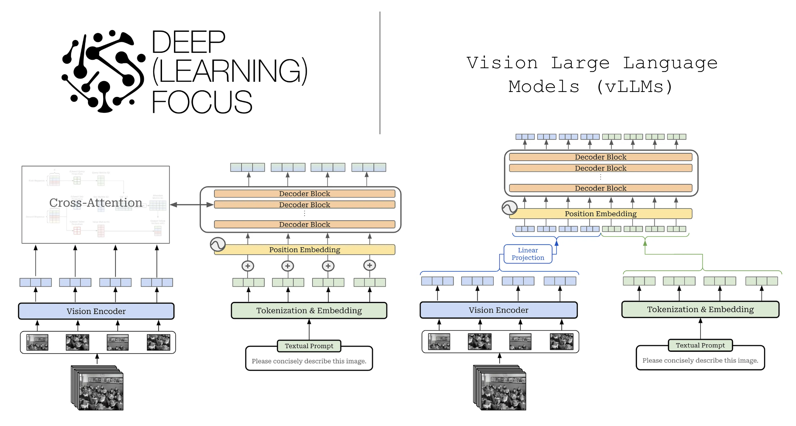
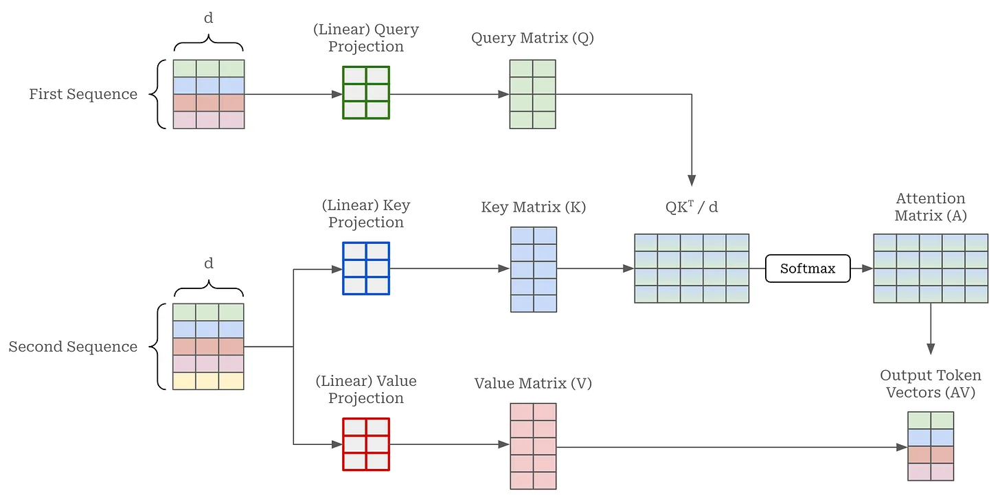
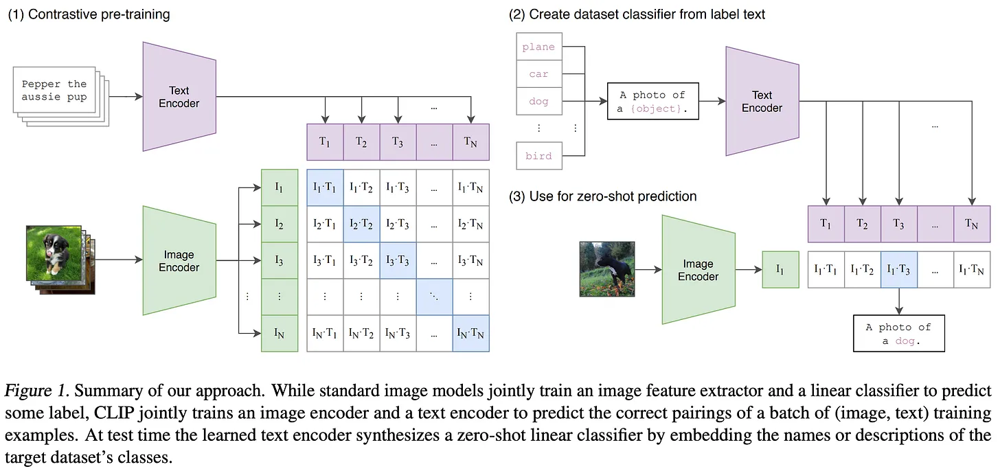
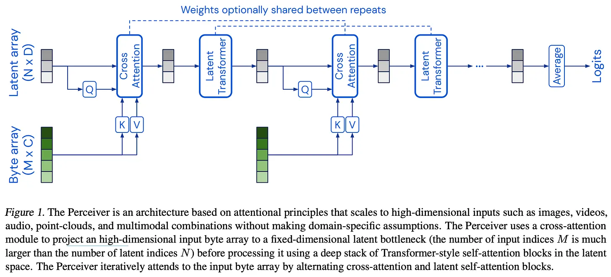
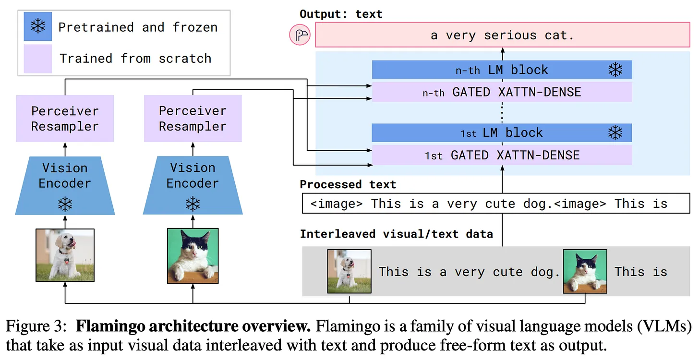
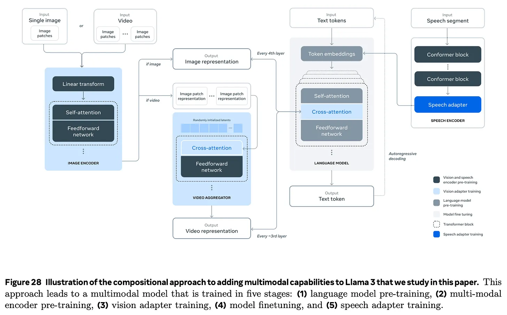
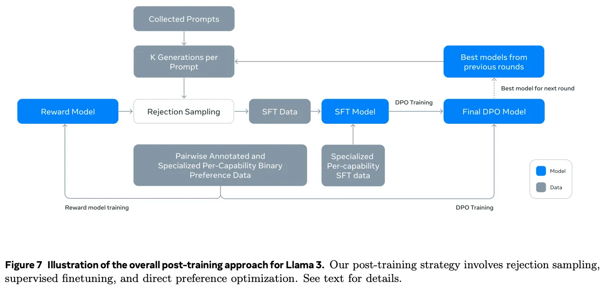
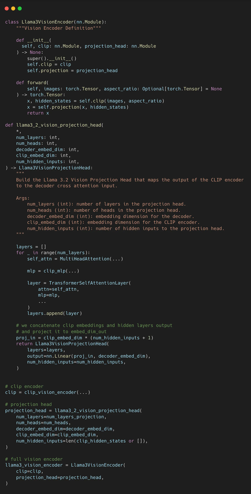

## Vision Large Language Models

[Vision Large Language Models (vLLMs)](https://cameronrwolfe.substack.com/p/vision-llms)

## 一、文章的核心问题与基础模块

### 1.1 文章要回答的问题

### 1.1.1 vLLM到底是什么

这篇文章讨论的核心对象是 vision Large Language Models，也就是能够处理图像乃至视频输入、但主要仍以文本作为输出的大语言模型。作者的重点并不是把它描述成一种和文本 LLM 完全不同的新范式，而是试图解释：研究者究竟如何把视觉信息接到原本只擅长处理文本的语言模型上，使模型既能“看”，又能继续“说”。文章整体围绕这个问题展开，逐步说明视觉输入怎样被编码、怎样被注入语言模型，以及这些系统在训练和实现上通常采取什么路线。

### 1.1.2 作者的总体判断

作者最重要的判断是，vLLM 虽然在能力表现上看起来很新，但在结构上并没有神秘到脱离文本 LLM 的基本范式。一个典型的 vLLM 往往仍然保留标准的 decoder-only 语言模型作为主体，然后额外加入一个视觉编码器，以及若干把视觉特征融合进 LLM 的模块。换句话说，vLLM 的本质并不是推翻已有 LLM，而是在其基础上增加“视觉输入接口”和“跨模态融合机制”。

### 1.1.3 为什么这个问题重要

作者认为，多模态研究的重要性至少体现在三个方面。首先，视觉输入显著扩大了模型的能力范围，使其能够处理图像描述、文档理解、图表问答等文本模型难以独立完成的任务。其次，图文对、视频文本对等多模态数据为模型训练提供了新的资源。最后，vLLM 的出现意味着语言模型不再只是抽象符号处理器，而开始具备连接现实视觉世界的能力。

### 1.2 理解vLLM的第一个基础：Cross-Attention

### 1.2.1 它和self-attention有什么区别

文章首先强调了 cross-attention，因为它是现代多模态 LLM 中最常见的融合机制之一。self-attention 处理的是同一序列内部 token 之间的关系，而 cross-attention 处理的是两个不同序列之间的关系。在 cross-attention 中，一个序列提供 query，另一个序列提供 key 和 value，因此输出长度由 query 所在序列决定。

### 1.2.2 它为什么适合做多模态融合

在 vLLM 中，最典型的做法是让文本 token 作为 query，让视觉 token 作为 key/value。这样一来，语言模型在生成文本时，就可以通过 cross-attention 去主动读取图像表示。<u>**视觉信息不是被静态拼接到系统外围，而是通过注意力机制在生成过程中被动态访问和利用。**</u>作者实际上是在借此说明，vLLM 的关键不是“模型看到了图像”，而是“模型能在生成文本时以一种可学习的方式查询图像”。

### 1.3 理解vLLM的第二个基础：Vision Transformer 与 CLIP

### 1.3.1 Vision Transformer如何把图像变成序列

为了让语言模型使用图像，首先必须把图像表示成 Transformer 能处理的序列形式。Vision Transformer 的基本思路是把图像(H,W,3)切成多个 patch(X,Y,3)，把每个 patch 展平成向量(X*Y*3)，再投影成 embedding(映射到隐藏维度D，隐藏维度就是 Transformer 中每个 token 在模型内部的表示长度，是模型统一使用的特征空间维数)，并加入位置信息，最终得到一串视觉 token。这样，图像就从二维像素阵列变成了类似文本 token 序列的结构，可以被 Transformer 编码。

在实现上，ViT 的 patch embedding 不一定真的先手工切 patch、再 flatten、再过 Linear。很多代码里会直接用一个卷积层来等价实现这三步，比如 kernel size = patch size ; stride = patch size。这样做更高效，但数学含义是一样的：本质上还是把每个 patch 变成一个 embedding token。

### 1.3.2 为什么ViT通常是encoder-only

作者特别指出，ViT 通常采用 encoder-only 结构，而不是 LLM 常见的 decoder-only 结构。这是因为视觉编码器的目标是同时看完整张图，提取全局视觉表示，而不是像文本生成那样逐个预测后续 token。因此，ViT 不需要因果遮罩，也不需要像 decoder-only LLM 那样限制对未来位置的访问。

### 1.3.3 CLIP为什么重要

在解释完 ViT 之后，文章进一步讲到 CLIP。CLIP 由图像编码器（ViT）和文本编码器(decoder-transformer)组成，通过对比学习把图像和文本映射到同一语义空间。作者认为，CLIP 的关键贡献不只是“做了一个图文模型”，而是提供了一种利用海量图文对训练视觉编码器的有效方法（ViT需要大量有标注的图像分类数据集，要训一个参数量巨大的ViT数据集成本太高）。正因为如此，现代 vLLM 往往会直接复用 CLIP 风格的图像编码器，而不是完全重新训练一个视觉 backbone。

CLIP就是弄一组图片加对应文本分别弄进图像文本编码器然后最大化真正图像-文本对的余弦相似度同时最小化其他对的相似度。

### 1.3.4 CLIP对vLLM的真正价值

CLIP 对 vLLM 的真正价值在于，它提供了一个已经具备强泛化能力的视觉特征提取器。对于多模态系统来说，这意味着研究者不必从零开始解决“图像如何编码”这个问题，而可以把更多精力放在“视觉信息如何接入 LLM”上。也正因此，后文的 LLaMA-3 系列扩展方案会把 CLIP-style encoder 作为非常自然的起点。

## 二、vLLM的架构思路与训练逻辑

### 2.1 从图像到视频：为什么需要额外的压缩与聚合

### 2.1.1 视频本质上是连续图像

文章在图像之后专门讨论视频，是为了说明视频并不是完全不同的一类输入，而更像是带有时间维度的一组图像帧。理论上，图像处理方法可以迁移到视频上：先对每一帧做视觉编码，再把它们作为时间序列来处理。

### 2.1.2 视频为什么更难

但视频比图像更难处理，因为帧数一多，视觉 token 的数量就会迅速膨胀。如果把每一帧都完整编码并全部送进 LLM，系统的计算成本会急剧上升。因此，视频任务不能只靠“逐帧编码”，还必须解决如何抽样、压缩和聚合视觉信息的问题。

**Perceiver**:不用让所有输入 token 两两做 self-attention，而是先准备一小组可学习的 latent 向量，让它们去“读取”超长输入，再只在这组 latent 内部做深层计算。模型不再直接对N 个输入做全局 self-attention，而是先让这M 个 latent 通过**asymmetric cross-attention**从原始输入中收集信息，于是这一层的复杂度从$O(N^2) $变成了大致$O(N*M)$；之后真正昂贵的 self-attention 只发生在M 个 latent 之间，复杂度是$O(M^2)$。只要M 比N 小很多，总成本就会显著下降.

**Perceiver 不是把输入压缩成固定池化向量那么简单，它是用一组可学习 latent 作为“中介表示”**。这些 latent 不是来自输入本身，而是模型参数中的一组初始向量，训练过程中学会如何从不同模态输入里提取有用信息。所以它比平均池化或简单下采样灵活得多，因为“压缩规则”不是手工写死的，而是由 attention 学出来的。

### 2.1.3 Perceiver Resampler的作用

作者用 Perceiver Resampler 作为典型例子说明视频处理中的聚合机制。其基本思路是先抽取固定数量的帧，再让每一帧经过已有图像编码器，然后用 Resampler 把大量帧表示压缩成固定数目的更紧凑视觉 token，最后再通过 cross-attention 接入 LLM。这个思路说明，视频建模在很多情况下并不是重新做一个完全独立的模型，而是在图像建模基础上增加时序压缩层。

### 2.2 vLLM的两类主流架构

本文第一张图就是两种架构对比

### 2.2.1 Unified Embedding：拼接式架构

作者把第一类主流方案概括为 unified embedding。它的做法是先通过视觉编码器得到图像 token，再把这些视觉 token 和文本 token 直接拼接成一个长序列，一起送入 decoder-only LLM。这样做的最大优点是直观，整个系统仍然只是在处理一个更长的 token 序列，训练目标也仍然可以保持为 next-token prediction。

### 2.2.2 拼接式架构的代价

不过，这种方案有明显代价。由于视觉 token 会像普通 token 一样穿过 LLM 的所有层，整个模型的上下文长度和计算量都会增加。对于视觉输入很长的场景，尤其是视频任务，这种成本会变得相当高。因此 unified embedding 虽然概念简单，但未必是大规模系统中最经济的路线。

### 2.2.3 Cross-Modality Attention：注入式架构

第二类方案是 cross-modality attention，也是作者更强调的一条路线。在这种架构中，文本 token 仍然是 LLM 主干的核心输入，视觉 token 不直接拼进主序列，而是通过额外的 cross-attention 层在中间阶段被读取。也就是说，语言模型继续沿着原有路径处理文本，而新增的融合层在若干关键位置让模型接触视觉表示。

### 2.2.4 注入式架构为什么更实用

这种注入式架构的优势在于，它不必把大量视觉 token 全部塞进主输入序列，因此计算通常更可控。此外，融合逻辑被显式隔离到新增模块中，这意味着训练时可以冻结语言模型主干，只训练视觉编码器和这些融合层。这样既能保留原有文本能力，也能更高效地增加视觉能力。

### 2.3 vLLM为什么常用组合式训练

### 2.3.1 输出目标其实仍然是文本预测

作者特别说明，这里讨论的大多数 vLLM 虽然能接受视觉输入，但输出仍以文本为主。因此从训练目标上说，它们与普通 LLM 并没有本质区别，仍然是 next-token prediction。多模态输入并不意味着必须重新发明完全不同的训练目标。

### 2.3.2 原生多模态训练为什么难

理论上，研究者当然可以从零开始训练一个原生多模态模型，把文本、图像和视频等数据一起送进去联合训练。但作者认为，这条路线在实践中很难，因为高质量成对数据难以获取，视觉 tokenization 在大规模训练下代价很高，而且不同模态之间可能出现失衡，导致模型并不能充分利用图像，甚至学会忽略视觉输入。

### 2.3.3 组合式训练为什么更现实

因此，现实中更常见的做法是 compositional training，也就是组合式训练。先分别把文本 LLM 和视觉编码器训练好，再用一个融合阶段把两者连接起来。这样可以复用现成的强文本模型，也可以复用强视觉模型，同时还允许文本数据、视觉数据和图文配对数据各自在适合的阶段发挥作用。作者显然认为，这是一条更符合工业实践和计算预算约束的路线。

### 2.3.4 冻结LLM主干的意义

在组合式训练中，一个非常关键的策略是冻结 LLM backbone，只训练视觉编码器和新增 adapter。这样做的好处不仅是节省计算，更在于尽量不破坏原本已经很强的文本能力。作者后面用 LLaMA-3.2 Vision 证明，这种做法确实可以让模型在加入视觉能力的同时基本保持 text-only 能力不变。

## 三、LLaMA-3 到 LLaMA-3.2 Vision 的具体实现

### 3.1 LLaMA-3如何扩展到视觉

### 3.1.1 整体思路

作者把 LLaMA-3 视作组合式多模态训练的代表案例。其基本思路很清晰：先有一个已经训练好的文本 LLaMA-3，再接一个预训练好的 CLIP-style 图像编码器，然后在两者之间插入 cross-attention 层，也就是所谓的 image adapter。这样，语言模型本体不需要从头重训，只需要学会在生成文本时利用来自图像编码器的视觉表示。

### 3.1.2 图像编码器并不是简单照搬

文章还指出，LLaMA-3 的视觉侧虽然基于 CLIP-style ViT-H，但并不是把现成 CLIP 输出原封不动塞给 LLM。为了更好保留细粒度信息（包括相对位置信息和场景理解，而不是只获取语义信息），系统会从多个视觉层抽取特征，并在视觉编码器末端增加额外的 self-attention 层。也就是说，作者强调的不是“直接插上一个 CLIP”，而是“用一个 CLIP 风格的高质量视觉骨干作为基础，再做进一步适配”。

### 3.1.3 Image Adapter

作者将这些插入到 LLM 若干层中的 cross-attention 模块称为 image adapter。它们通常不是每层都加，而是隔几层加一次，例如文中提到的每四层一次。这样做说明视觉信息在 LLM 中不是全程持续流动，而是周期性地被读取和融合，这是一种在能力与成本之间做平衡的设计。

### 3.1.4 Full architecture

加入video adapter

### 3.2 数据与训练过程如何支持视觉能力

[embed]()

### 3.2.1 数据构造体现能力目标

文章对 LLaMA-3 视觉训练数据的描述非常有启发性。为了提升文档理解能力，研究者会把 OCR 结果附加到 caption 后面，并使用大量 document-text pairs。除此之外，还会加入网页截图、视觉 grounding、问答对、表格图像、图表示意图等数据做预训练。由此可以看出，模型擅长文档和图表理解并不是偶然，而是因为训练数据专门向这些场景倾斜。

### 3.2.2 训练分阶段进行

在训练流程上，作者强调这类系统通常采用分阶段路线。先进行较大规模的图文预训练，再进行更高质量、更高分辨率的数据训练，最后做后训练。后训练阶段会沿用文本 LLM 中已被证明有效的方法，例如监督微调、rejection sampling 以及 DPO。这个过程反映出，多模态系统并不需要重新设计整套训练哲学，而是可以沿用文本 LLM 的成熟后训练流程。

### 3.3 LLaMA-3.2 Vision的正式落地

[link_preview](https://github.com/pytorch/torchtune)

[https://github.com/pytorch/torchtune/tree/main/torchtune/models/llama3_2_vision](https://github.com/pytorch/torchtune/tree/main/torchtune/models/llama3_2_vision)

### 3.3.1 它在系列中的位置

文章指出，虽然此前的 LLaMA-3 技术路线已经讨论了多模态扩展，但官方正式推出支持图像输入的模型是在 LLaMA-3.2 Vision 阶段完成的。该系列提供 11B 和 90B 两个 vision 模型，是 LLaMA 家族中正式面向视觉输入的重要版本。

### 3.3.2 它的架构非常典型

作者认为，LLaMA-3.2 Vision 几乎就是全文前面理论框架的标准实例：一个预训练的文本 LLM backbone，一个预训练的视觉编码器，再加上若干 cross-attention 融合层。它并没有走极端复杂的新路线，而是用非常“模块化”的方式把视觉能力叠加到原有 LLM 上。

### 3.3.3 它为什么能保持文本能力

一个非常重要的设计点是，在多模态训练中，LLaMA-3.2 Vision 不更新 LLM backbone，只更新图像编码器和 adapter 层。作者特别强调，这样做使得模型的 text-only 能力能够与原有的 LLaMA-3.1 保持基本一致。这一点恰好体现了组合式训练和注入式架构的工程价值：在不破坏原有语言能力的前提下，引入新的视觉能力。

### 3.3.4 它为什么擅长文档与图表任务

文章认为，LLaMA-3.2 Vision 在文档、图表和示意图任务上的强表现，很大程度上来自训练数据中大量的文档图像与文本配对，以及专门合成的图表和表格图像。这说明模型能力并不只是架构自动“涌现”的结果，更是训练数据设计和任务导向共同作用的结果。

## 四、代码实现视角与全文总结

### 4.1 从实现角度看LLaMA-3.2 Vision

### 4.1.1 顶层结构是FusionModel

文章最后从 torchtune 的实现视角解释 LLaMA-3.2 Vision。作者指出，顶层可以理解为一个 FusionModel，它负责把图像编码器和语言模型主干组装在一起，并协调二者之间的信息流。这个对象在形式上尽量保持与普通 transformer decoder 类似，从而使整个系统更容易集成与复用。

### 4.1.2 视觉侧还有Projection Head

视觉编码器的输出并不会直接送入 LLM，中间还会经过 VisionProjectionHead。这个模块负责从多个视觉隐藏层中抽取并拼接特征，再投影到与语言模型 token 维度一致的空间中，有时还会在接入前加额外的 self-attention 处理。作者借此强调，视觉侧的适配并不是简单的“维度对齐”，而是一次有目的的信息重组。

### 4.1.3 语言侧尽量保持原样

在语言模型这一侧，作者描述得很明确：vision decoder 的主体仍然非常像普通文本 LLM，真正新增的是少量负责融合视觉信息的层。代码里通常会把原始 decoder block 和 fusion block 分离开来，这与前文所说的“冻结主干、训练适配层”完全一致。

### 4.2 这篇文章最值得记住的结论

### 4.2.1 概念层面的结论

整篇文章最值得记住的概念结论是：vLLM 并不是一种脱离 LLM 传统的新黑箱，而是在标准语言模型之上增加视觉编码器与跨模态融合层的系统。理解了这一点，很多 vision LLM 的架构就会显得没有那么神秘。

### 4.2.2 工程层面的结论

从工程角度看，作者明显更认可一种现实路线：先把文本模型和视觉模型分别做到足够强，再用 cross-attention 等方式把两者连接起来。这条路线比从零做一个完全原生的多模态大模型更可控，也更容易继承现有 LLM 的文本能力和训练经验。

### 4.2.3 能力来源层面的结论

从能力来源看，文章也传达了一个重要判断：架构决定模型能否接入视觉信息，训练策略决定系统能否高效扩展，而具体擅长哪些任务，则很大程度上取决于数据构造。LLaMA-3.2 Vision 在文档和图表任务上的表现，正是架构、训练和数据三者共同作用的结果。

